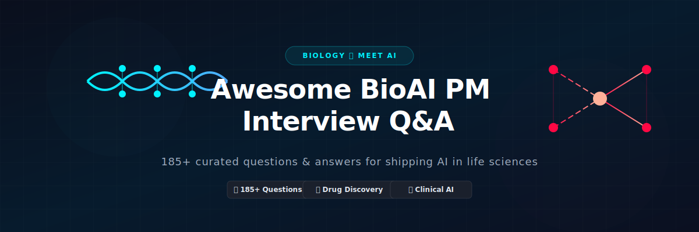

<p align="center">
  
</p>

# 🧬 Awesome BioAI Product Manager Interview Q&A 🤖

<p align="center">
  <a href="https://github.com/ishandutta2007/Awesome-Awesome-Awesome"></a><a href="https://discord.gg/jc4xtF58Ve"></a><a href="https://github.com/ishandutta2007"></a>
</p>

A comprehensive, community-curated collection of **185+ interview questions and answers** for **BioAI Product Manager** roles — professionals who ship AI/ML-powered products at the intersection of biology, drug discovery, diagnostics, and healthcare, balancing scientific rigor, regulatory reality, and product velocity.

---

## 📌 Overview

**BioAI Product Managers** define and ship products where machine learning meets biology and medicine — protein structure prediction tools, AI-assisted drug discovery platforms, diagnostic ML models, clinical decision support software, and lab automation/AI copilots. The role requires fluency across ML product management, biological/clinical domain literacy, regulatory awareness (SaMD, CLIA), and the unique go-to-market dynamics of life sciences and healthcare.

This repository covers:
- 🧪 **BioAI product strategy & market landscape**
- 🧠 **ML product management fundamentals** (model lifecycle, metrics, uncertainty)
- 🧬 **Drug discovery & computational biology** domain knowledge
- 🏥 **Clinical AI & diagnostics** product management
- ⚖️ **Regulatory pathways** (FDA SaMD, CLIA, companion diagnostics)
- 💾 **Data strategy, licensing & wet-lab/dry-lab collaboration**
- 🚀 **Go-to-market** for scientific and clinical customers
- 🛡️ **Ethics, trust, and responsible AI** in biology/medicine

* **⏱️ Estimated preparation time:** 30–50 hours
* **🤝 Interview duration:** Typically 4–6 rounds (3–5 hours total), often including a product sense/case study round and a technical ML+bio deep dive

---

## 📚 Repository Structure

```
Awesome-BioAI-Product-Manager-Interview-QA/
├── README.md
├── CONTRIBUTING.md
├── LICENSE
├── assets/
│   └── banner.svg
├── topics/
│   ├── 01-BioAI-Landscape-Fundamentals.md
│   ├── 02-ML-Product-Management-Core.md
│   ├── 03-Drug-Discovery-Computational-Biology.md
│   ├── 04-Clinical-AI-Diagnostics-Products.md
│   ├── 05-Regulatory-Strategy-SaMD.md
│   ├── 06-Data-Strategy-Lab-Collaboration.md
│   ├── 07-Model-Evaluation-Trust-Uncertainty.md
│   ├── 08-Go-To-Market-Scientific-Customers.md
│   ├── 09-Product-Case-Studies-Prioritization.md
│   ├── 10-Cross-Functional-Leadership.md
│   ├── 11-Troubleshooting-Failure-Modes.md
│   └── 12-Ethics-Responsible-AI-Industry-Context.md
├── docs/
│   ├── glossary.md
│   ├── resources.md
│   └── roadmap.md
└── .gitignore
```

---

## 🎯 Topic Breakdown

| # | Topic | Focus Area | Q&A Count |
|---|-------|-----------|-----------|
| 01 | 🌍 BioAI Landscape & Fundamentals | Market map, product archetypes, biology-for-PMs | 16 |
| 02 | ⚙️ ML Product Management Core | Model lifecycle, PRDs, eval-driven development | 16 |
| 03 | 🧬 Drug Discovery & Computational Biology | Target ID, protein design, generative chemistry | 16 |
| 04 | 🏥 Clinical AI & Diagnostics Products | Imaging AI, EHR-based models, point-of-care | 15 |
| 05 | ⚖️ Regulatory Strategy & SaMD | FDA AI/ML SaMD, PCCP, CLIA, companion diagnostics | 16 |
| 06 | 💾 Data Strategy & Lab Collaboration | Data licensing, wet-lab loops, active learning | 15 |
| 07 | 🧪 Model Evaluation, Trust & Uncertainty | Benchmarks, calibration, human-in-the-loop | 15 |
| 08 | 🚀 Go-To-Market for Scientific Customers | Pharma/biotech sales motion, KOLs, adoption | 15 |
| 09 | 🎯 Product Case Studies & Prioritization | Roadmapping, trade-offs, 0-to-1 launches | 15 |
| 10 | 👥 Cross-Functional Leadership | Working with scientists, clinicians, ML engineers | 15 |
| 11 | 🔧 Troubleshooting & Failure Modes | Model drift, silent failures, postmortems | 15 |
| 12 | 🛡️ Ethics, Responsible AI & Industry Context | Bias, explainability, market trends | 15 |
| | **📊 TOTAL** | | **184** |

---

## 🚀 How to Use This Repository

### 📅 Study Plan (6 Weeks)
* **Week 1:** Topics 01–02 (Landscape + ML PM Core)
* **Week 2:** Topics 03–04 (Drug Discovery + Clinical AI)
* **Week 3:** Topics 05–06 (Regulatory + Data Strategy)
* **Week 4:** Topics 07–08 (Trust/Eval + GTM)
* **Week 5:** Topics 09–10 (Case Studies + Cross-Functional)
* **Week 6:** Topics 11–12 + Mock Interviews + Review

---

## 📖 Quick Start Example

**From [Topic 07: Model Evaluation, Trust & Uncertainty](topics/07-Model-Evaluation-Trust-Uncertainty.md)**

> **❓ Q: A protein-binding-affinity prediction model shows strong aggregate R² on your benchmark, but wet-lab validation success rate hasn't improved. How do you diagnose and reframe the product metric?**
>
> **💡 A:** Aggregate R² can mask exactly the failure mode that matters for a discovery product: performance on the *long tail* of novel, out-of-distribution candidates the model is actually meant to help find — high-confidence predictions on well-represented chemical space inflate the aggregate score while providing no real decision value. Reframe the core product metric around enrichment (hit rate improvement vs. random/baseline selection) on genuinely novel candidates, stratify performance by distance from training distribution, and treat "wet-lab hit rate on model-prioritized candidates" as the north star metric the offline R² must be shown to correlate with before it can be trusted as a proxy.

---

## 🤝 Contributing

See **[CONTRIBUTING.md](CONTRIBUTING.md)** for guidelines.

**Areas seeking contributions:**
- Foundation model (protein LLMs, single-cell foundation models) product strategy
- Agentic AI/lab-automation product management
- Region-specific regulatory nuances (EMA AI Act, PMDA, NMPA)
- De-identified 0-to-1 launch case studies

---

## 📜 License
MIT License — see **[LICENSE](LICENSE)**.

---

**Last Updated:** July 2026
**Contributors:** 1 (growing!)
